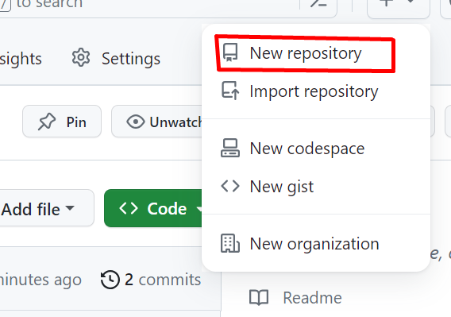
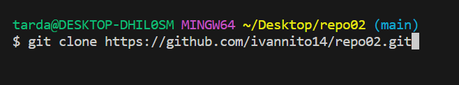
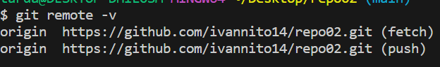
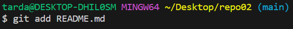
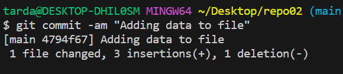
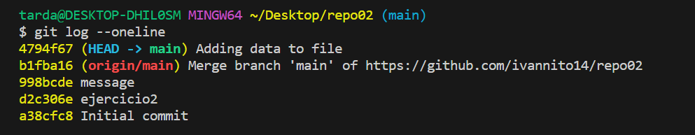

# repo02
📌2.1 - Crea un repositorio llamado repo02 desde GitHub. ¿Sería considerado un repositorio local o remoto?

- Seria Remoto ya que lo estamos creado desde la nube en github.com y lo añadimos con readme.md

📌2.2 – Posteriormente, clónalo (mediante al comando git clone), lo que realizará una copia
del repositorio remoto en nuestro equipo, creando con ello un repositorio local a partir del repositorio en remoto.
     
-    Despues de hacerlo ponemos ``git remote -v`` para verificar que esta bien.
    
📌2-3 - Añade un fichero readme.md y ejecuta los comandos pertinentes hasta llegar a poder
realizar un commit.
-    Para verificar los ficheros que tenemos ponemos ``git status`` como podemos ver esta en rojo y lo tenemos que añadir una vez visto con ``git status`` añadimos  ``git add readme.md`` una vez añadido ponemos ``git status`` para verificar que lo hemos echo bien. 

      
- Una vez realizado ponemos git commit -am "adding data to file" para poderla pasar a la rama.

- Una vez se haya echo, lo que vamos a poner va a ser ``git log --oneline`` para mirar si esta en la misma linea.

- Como no lo tenemos lo que vamos hacer es un ``git push -u origin main`` para que este todo en la misma linea ara si volvemos a poner ``git log --oneline``

- Ara hacemos un ``git push origin main`` para subir el fichero.
